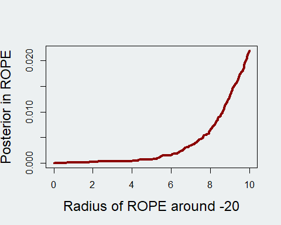
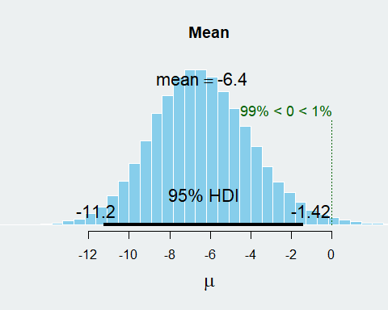
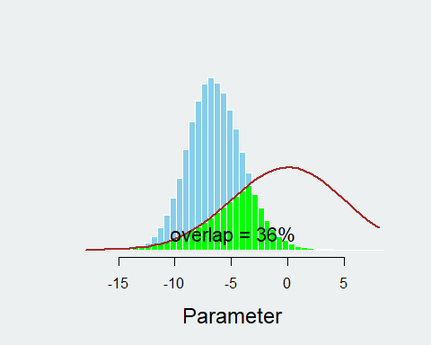
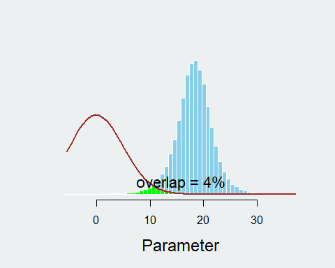
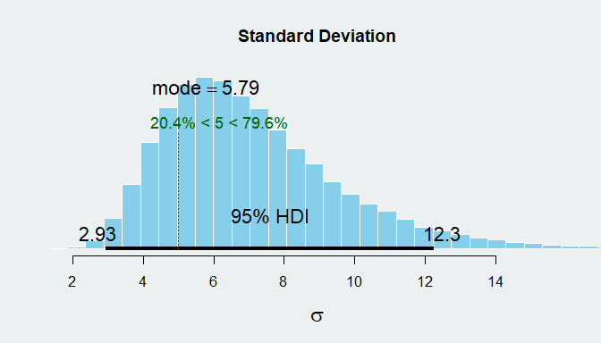

Overview
--------

Data background
---------------

I managed to find one study where people weighed ten large fries from a
[Japanese
McDonalds](https://en.rocketnews24.com/2011/11/29/mcdonalds-japan-skimping-on-french-fries-we-weight-6500g-of-fries-average-large-fry-10g-short/)
and a single sample from the
[UK](http://www.birminghammail.co.uk/whats-on/food-drink-news/mcdonalds-fries-how-much-you-12723239).
This data will be used to produce a prior for the New Zealand data.
However, each country seems to have a different weight for their fries
to for simplicity, I subtracted the average weight such that
measurements represent how many grams over or under-weight they are (see
below code).

    #Set plot parameters
    par(bg = '#ecf0f1')

    #Set expected weights so we can standardize to zero
    japWgt <- 170
    britWgt <- 150
    nzWgt <- 120

    #Load Japanese data and British datum subtracting weight so expected mean is 0
    japData <- read.csv("japaneseData.csv")$wgt - japWgt
    britData <- read.csv("britishData.csv")$wgt - britWgt

    priorData <- append(japData, britData)

    #Load NZ data
    nzData <- read.csv("nzData.csv")$wgt - nzWgt

Here is the data after I had imported and rescaled it:
<table class="table table-striped table-hover table-condensed" style="width: auto !important; margin-left: auto; margin-right: auto;">
<thead>
<tr>
<th style="text-align:right;">
Weight
</th>
<th style="text-align:left;">
Country
</th>
</tr>
</thead>
<tbody>
<tr>
<td style="text-align:right;">
-21
</td>
<td style="text-align:left;">
Japan
</td>
</tr>
<tr>
<td style="text-align:right;">
-15
</td>
<td style="text-align:left;">
Japan
</td>
</tr>
<tr>
<td style="text-align:right;">
-15
</td>
<td style="text-align:left;">
Japan
</td>
</tr>
<tr>
<td style="text-align:right;">
-13
</td>
<td style="text-align:left;">
Japan
</td>
</tr>
<tr>
<td style="text-align:right;">
-12
</td>
<td style="text-align:left;">
Japan
</td>
</tr>
<tr>
<td style="text-align:right;">
-9
</td>
<td style="text-align:left;">
Japan
</td>
</tr>
<tr>
<td style="text-align:right;">
-6
</td>
<td style="text-align:left;">
Japan
</td>
</tr>
<tr>
<td style="text-align:right;">
-4
</td>
<td style="text-align:left;">
Japan
</td>
</tr>
<tr>
<td style="text-align:right;">
-3
</td>
<td style="text-align:left;">
Japan
</td>
</tr>
<tr>
<td style="text-align:right;">
-1
</td>
<td style="text-align:left;">
Japan
</td>
</tr>
<tr>
<td style="text-align:right;">
10
</td>
<td style="text-align:left;">
Britain
</td>
</tr>
<tr>
<td style="text-align:right;">
15
</td>
<td style="text-align:left;">
New Zealand
</td>
</tr>
<tr>
<td style="text-align:right;">
19
</td>
<td style="text-align:left;">
New Zealand
</td>
</tr>
<tr>
<td style="text-align:right;">
27
</td>
<td style="text-align:left;">
New Zealand
</td>
</tr>
<tr>
<td style="text-align:right;">
19
</td>
<td style="text-align:left;">
New Zealand
</td>
</tr>
<tr>
<td style="text-align:right;">
14
</td>
<td style="text-align:left;">
New Zealand
</td>
</tr>
</tbody>
</table>
We can already see that the mean from Japanese data doesnt look like a
good reference for our NZ data but Im curious to see how we might
leverage off the variance and also how much such this helps vs hinders
our small sample size.

What would we expect the distribution to look like ?
----------------------------------------------------

I was interested in what we might expect the distribution to look like
in NZ. What is an *acceptable* amount of variance from our expected mean
?

Well... we can assume people will be pissed off if they order a large
fries and the weight falls within the same distribution as medium fries.
In NZ a medium fries weights 100g and a large fries weighs 120g
(estimated from average serving
[info](https://mcdonalds.co.nz/menu/fries)).

Therefore we can tinker with some distributions using our rescaled means
where
*μ**L* = 0 *a**n**d* *μ**M* = −20

Using the `plotAreaInROPE()` function we can use samples from our
expected distribution and determine what percentage would be within a
certain range of our comparable value, in this case -20, the mean weight
for medium fries (See intended use for a ROPE
[here](http://doingbayesiandataanalysis.blogspot.co.nz/2013/08/how-much-of-bayesian-posterior.html)).

    plotAreaInROPE(rnorm(10000,0,5), 
                   compVal=-20, 
                   maxROPEradius = 10
                   )

We can see that with
*μ**L* = 0,  *σ**L* = 5
 only around 2% of large fries will be closer to a medium fry weight
than a large fry weight. It seems acceptable and we certainly wouldnt
want error to be much higher than that. This translates to an
approximate 95% credible interval of +/- 10g or 16%.

What does the past data tell us ?
---------------------------------

Eyeballing the previous data it looks very low. We should remember here
that the data was collected at a single restaurant at the same time,
i.e. likely the same person filled all boxes. To get around this I tried
have a more informed prior with the intention of correcting some
systematic error in the collection method.

Using the `BESTmcmc()` command I found it really easy to stick the data
in and specify a prior. I did set a moderate uncertainty around the mean
and standard deviation using the `muSD` and `sigmaSD` arguments. This
was to allow probabilities closer to the corrected data but to increase
the probability of converging closer to our intuitive prior.

    priorModel.naive <- BESTmcmc(priorData,
                                 prior = list(muM=0, 
                                              muSD=100, 
                                              sigmaMode=5, 
                                              sigmaSD=100)
                                 )

    ## Waiting for parallel processing to complete...done.

    priorModel.prior <- BESTmcmc(priorData,
                                 prior = list(muM=0, 
                                              muSD=5, 
                                              sigmaMode=5, 
                                              sigmaSD=5)
                                 )

    ## Waiting for parallel processing to complete...done.

The table below aggregates information from `summary()` when used on a
BESTmcmc object[1]. Compared to the vague prior, our informed prior did
effect the data as suspected. I think when we compare the two posterior
distributions, the effect of the informed prior seems fair and Im happy
to use it going forward.

<table class="table table-striped table-hover" style="width: auto !important; margin-left: auto; margin-right: auto;">
<thead>
<tr>
<th style="text-align:left;">
</th>
<th style="text-align:right;">
mean
</th>
<th style="text-align:right;">
HDIlo
</th>
<th style="text-align:right;">
HDIup
</th>
</tr>
</thead>
<tbody>
<tr grouplength="2">
<td colspan="4" style="border-bottom: 1px solid;">
<strong>Vague prior</strong>
</td>
</tr>
<tr>
<td style="text-align:left; padding-left: 2em;" indentlevel="1">
mu
</td>
<td style="text-align:right;">
-8.301955
</td>
<td style="text-align:right;">
-14.198804
</td>
<td style="text-align:right;">
-2.239812
</td>
</tr>
<tr>
<td style="text-align:left; padding-left: 2em;" indentlevel="1">
sigma
</td>
<td style="text-align:right;">
9.239513
</td>
<td style="text-align:right;">
4.878467
</td>
<td style="text-align:right;">
14.679411
</td>
</tr>
<tr grouplength="2">
<td colspan="4" style="border-bottom: 1px solid;">
<strong>Informed prior</strong>
</td>
</tr>
<tr>
<td style="text-align:left; padding-left: 2em;" indentLevel="1">
mu
</td>
<td style="text-align:right;">
-6.400721
</td>
<td style="text-align:right;">
-11.229128
</td>
<td style="text-align:right;">
-1.416135
</td>
</tr>
<tr>
<td style="text-align:left; padding-left: 2em;" indentLevel="1">
sigma
</td>
<td style="text-align:right;">
8.603560
</td>
<td style="text-align:right;">
4.871452
</td>
<td style="text-align:right;">
12.910049
</td>
</tr>
</tbody>
</table>
The BEST package has a really nice plot feature too. It can plot
mutliple parameters and below we can see the posterior distribution of
the mean. The comparative value is also displaced which in this case is
zero, a mean equal to the average weight of fries. Based on what we see
here there is only a 1% chance of the mean be equal to or greater than
zero (my frequentist brain wants to say this interpretation is wrong
though).

    plot(priorModel.prior)

If we consider the overlap with our prior (mu=0, sigma=5), we only see a
36% overlap between posterior and prior. Conversely if we used a vague
prior the overlap was about 28%.

    postPriorOverlap(priorModel.prior$mu, dnorm, mean=0, sd=5)

    ## [1] 0.3582743

What does the New Zealand data tell us ?
----------------------------------------

Now that we have a posterior using previous data, we can use it as a
prior for our NZ data. Ill also run the model using the original prior
and a vague prior for good measure.

    nzModel.naive <- BESTmcmc(nzData, 
                              prior = list(muM=0, 
                                           muSD=100, 
                                           sigmaMode=5, 
                                           sigmaSD=100))

    nzModel.prior <- BESTmcmc(nzData, 
                              prior = list(muM=0, 
                                           muSD=5, 
                                           sigmaMode=5, 
                                           sigmaSD=5))

    nzModel.japPrior <- BESTmcmc(nzData, prior = list(muM=mean(priorModel.prior$mu), 
                                                   muSD=sd(priorModel.prior$mu)*10, 
                                                   sigmaMode=summary(priorModel.prior)[2,3], 
                                                   sigmaSD=sd(priorModel.prior$sigma*2)))

Interestingly our table output shows the sigma is vastly reduced with
the data informed prior. Admittedly I did have to reduce certainty
around the mean though as the strong negative number from the previous
dataset made positive values highly improbable. We see in the informed
prior that mu decreases and sigma has decreased slightly too. This was
interesting to see how our more strict expectation of the prior effects
the data.

We can see across all models that values less than zero are quite
unlikely and with the data informed prior which borrows certainty for
sigma from previous data, our credible interval now doesn't even include
zero. Further to this, there is only a 0.4% chance of the mean being
less than zero given the data.

    kable(rbind(summary(nzModel.naive)[1:2,c(1, 5:6)], 
                summary(nzModel.prior)[1:2,c(1, 5:6)],
                summary(nzModel.japPrior)[1:2,c(1, 5:6)]),
          "html") %>%
      kable_styling(bootstrap_options = c("striped", "hover"), full_width = FALSE) %>%
      group_rows("Vague prior", 1, 2) %>%
      group_rows("Informed prior", 3, 4) %>%
      group_rows("Data informed prior (DI prior)", 5, 6)

<table class="table table-striped table-hover" style="width: auto !important; margin-left: auto; margin-right: auto;">
<thead>
<tr>
<th style="text-align:left;">
</th>
<th style="text-align:right;">
mean
</th>
<th style="text-align:right;">
HDIlo
</th>
<th style="text-align:right;">
HDIup
</th>
</tr>
</thead>
<tbody>
<tr grouplength="2">
<td colspan="4" style="border-bottom: 1px solid;">
<strong>Vague prior</strong>
</td>
</tr>
<tr>
<td style="text-align:left; padding-left: 2em;" indentlevel="1">
mu
</td>
<td style="text-align:right;">
18.604548
</td>
<td style="text-align:right;">
10.694314
</td>
<td style="text-align:right;">
26.64205
</td>
</tr>
<tr>
<td style="text-align:left; padding-left: 2em;" indentlevel="1">
sigma
</td>
<td style="text-align:right;">
7.625781
</td>
<td style="text-align:right;">
1.927156
</td>
<td style="text-align:right;">
16.80936
</td>
</tr>
<tr grouplength="2">
<td colspan="4" style="border-bottom: 1px solid;">
<strong>Informed prior</strong>
</td>
</tr>
<tr>
<td style="text-align:left; padding-left: 2em;" indentlevel="1">
mu
</td>
<td style="text-align:right;">
11.571630
</td>
<td style="text-align:right;">
2.572997
</td>
<td style="text-align:right;">
19.23040
</td>
</tr>
<tr>
<td style="text-align:left; padding-left: 2em;" indentlevel="1">
sigma
</td>
<td style="text-align:right;">
8.936263
</td>
<td style="text-align:right;">
2.757259
</td>
<td style="text-align:right;">
16.97233
</td>
</tr>
<tr grouplength="2">
<td colspan="4" style="border-bottom: 1px solid;">
<strong>Data informed prior (DI prior)</strong>
</td>
</tr>
<tr>
<td style="text-align:left; padding-left: 2em;" indentLevel="1">
mu
</td>
<td style="text-align:right;">
18.222967
</td>
<td style="text-align:right;">
11.345691
</td>
<td style="text-align:right;">
25.18011
</td>
</tr>
<tr>
<td style="text-align:left; padding-left: 2em;" indentLevel="1">
sigma
</td>
<td style="text-align:right;">
7.102347
</td>
<td style="text-align:right;">
2.932270
</td>
<td style="text-align:right;">
12.26085
</td>
</tr>
</tbody>
</table>
Comparing our what we believe the mean to be against our posterior
distribution of the mean, there is only a 7% overlap in the
distributions. If this effect held with a higher sample then its good
news I suppose... unless you are interested in accurate nutritional
information.

    postPriorOverlap(nzModel.japPrior$mu, dnorm, mean=0, sd=5)

    ## [1] 0.03624919

We can also look at our standard deviation to confirm if we are in the
right ball park with an estimated 5g. The plot below shows that our mode
sigma was 7.05 and that there is around a 90% chance that sigma is
greater than 5g.

    plot(nzModel.japPrior, which = "sd", compVal = 5)

In one final check I want to know how our three posterior distributions
of mu and sigma stack up between the three models. No surprises that the
largest overlap is between the vague prior for mu and the data informed
prior. It would be super interesting to see how accurate this posterior
is with more data.

<table class="table table-striped table-hover" style="width: auto !important; margin-left: auto; margin-right: auto;">
<thead>
<tr>
<th style="text-align:left;">
</th>
<th style="text-align:right;">
mu
</th>
<th style="text-align:right;">
sigma
</th>
</tr>
</thead>
<tbody>
<tr>
<td style="text-align:left;">
DI prior ~ Informed prior
</td>
<td style="text-align:right;">
0.38
</td>
<td style="text-align:right;">
0.77
</td>
</tr>
<tr>
<td style="text-align:left;">
DI prior ~ Vague prior
</td>
<td style="text-align:right;">
0.95
</td>
<td style="text-align:right;">
0.83
</td>
</tr>
<tr>
<td style="text-align:left;">
Informed prior ~ vague prior
</td>
<td style="text-align:right;">
0.35
</td>
<td style="text-align:right;">
0.76
</td>
</tr>
</tbody>
</table>
Conclusions
-----------

-   The mean of the Japanese/UK data was vastly different to the NZ data

-   There is less than a 1% chance that the average weight of large
    McDonalds fries is the 170g or greater in Japan

-   Our three samples benefit hugely from the increased certainty of
    sigma from the previous data

-   It is likely that the standard deviation of fry weight is larger
    than we estimates in our prior with a 90% chance of being greater
    than 5g

-   There is less than a 1% chance that the average weight of large
    McDonalds fries is the estimates 120g or less.

[1] To check the MCMC models converged properly I checked the Rhat was
close to one and samples were greater than n.eff. You can bring these
numbers up by typing your BESTmcmc object into the console.
